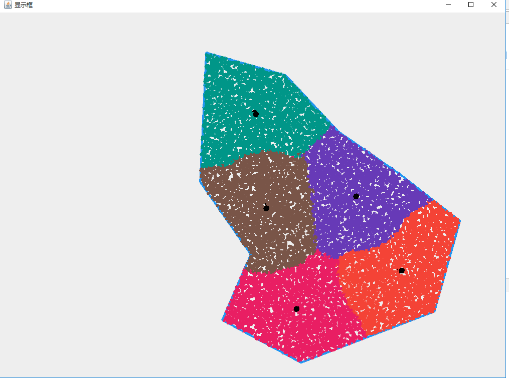
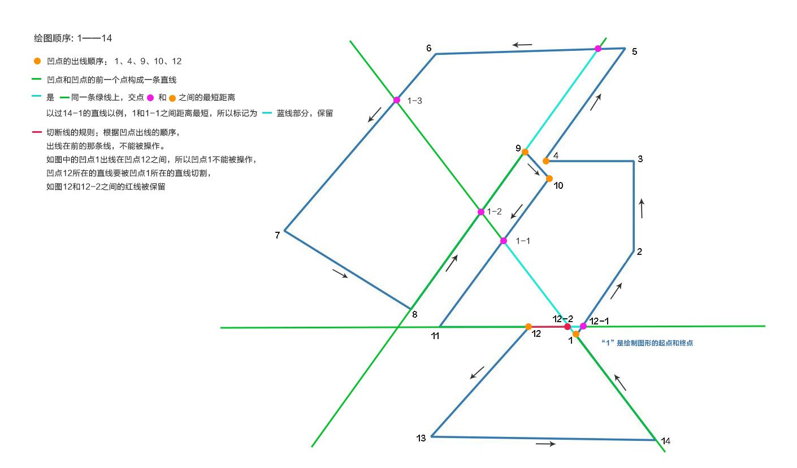
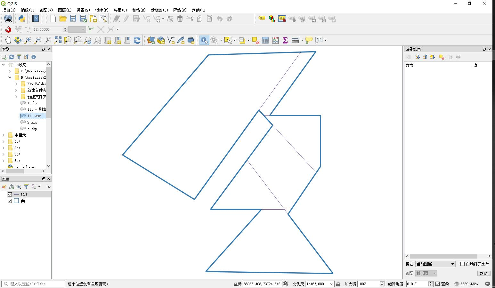
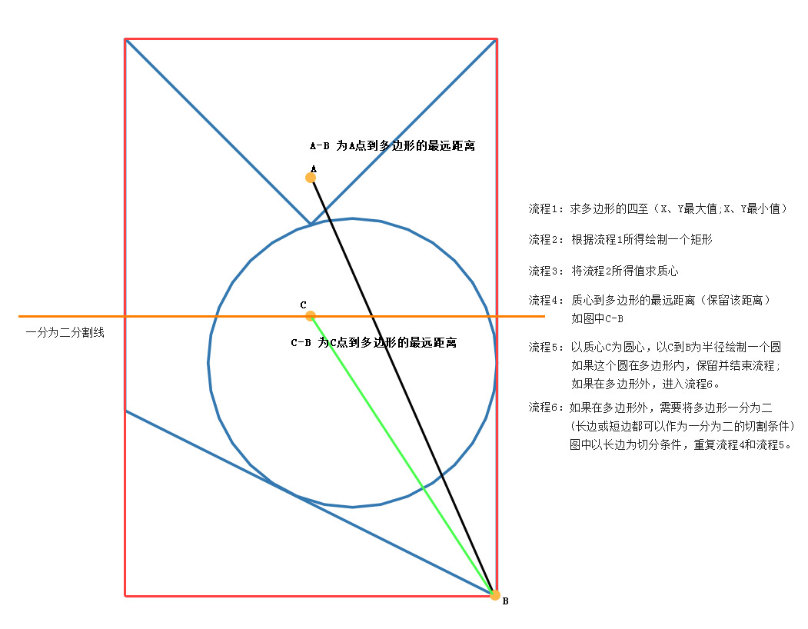
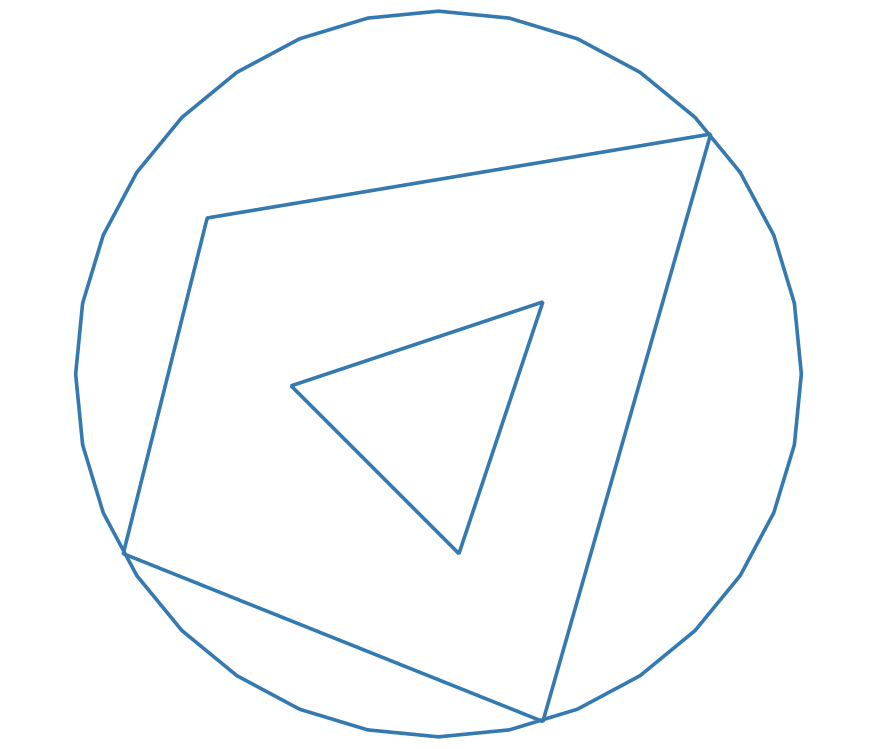
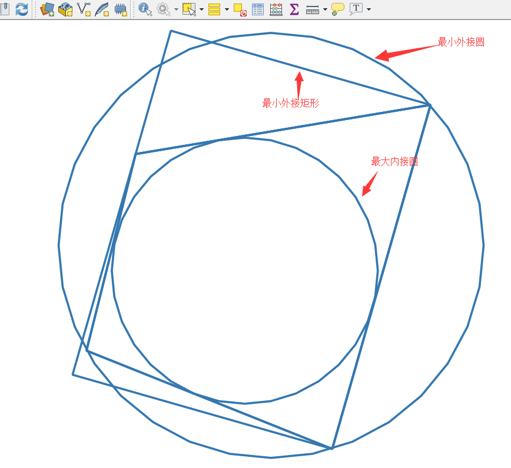
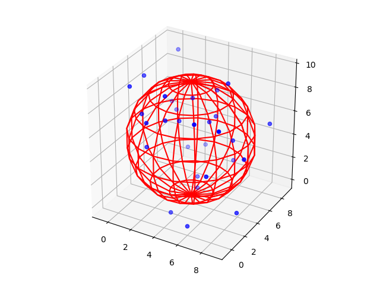
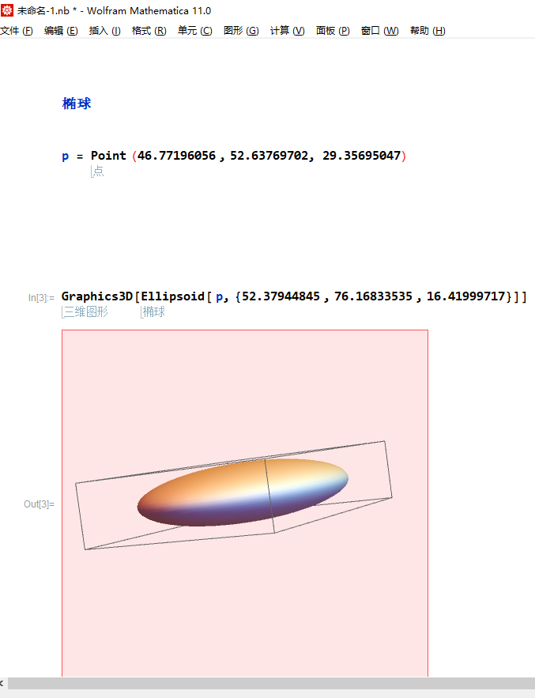
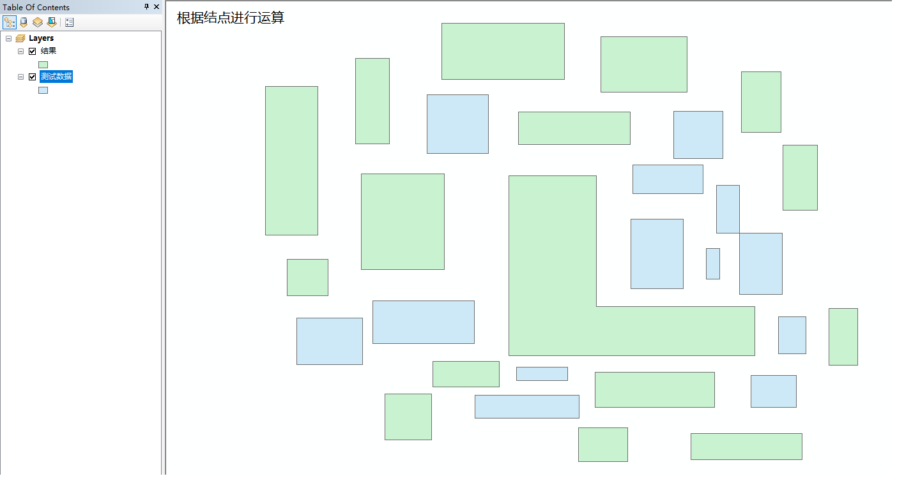
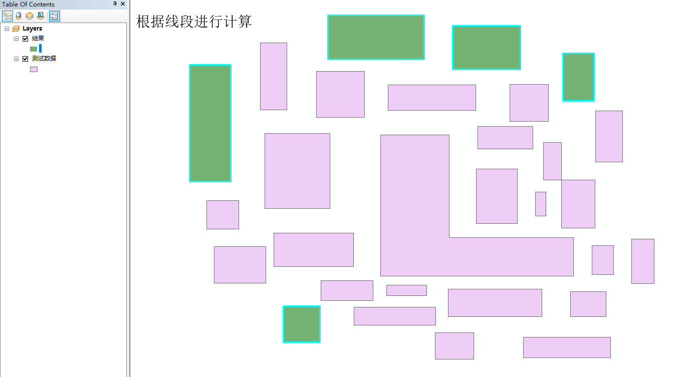

# planar_algorithm

#### 介绍
平面算法

关于 二维点 二维线的基础算法

- 坐标转换算法

- 反距离加权插值

- 利用构建规则网格(GRID) 计算体积

- 最短路径

- 纵断面计算

- [根据K-means 分割多边形](https://blog.csdn.net/staHuri/article/details/86482967)

- [最小外接矩形](#)

- [凹点切割](https://blog.csdn.net/staHuri/article/details/88057017)

- 最大内接圆

- 最小外接圆

- 拟合球体
  - 拟合球体 
  
  - 拟合椭球
  

- 多边形选择
  - 根据结点选择
  
  - 根据线段选择
  
